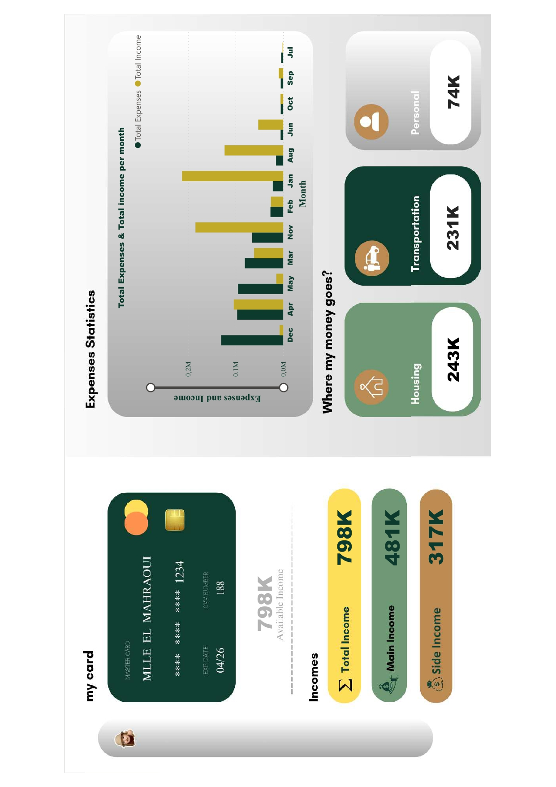
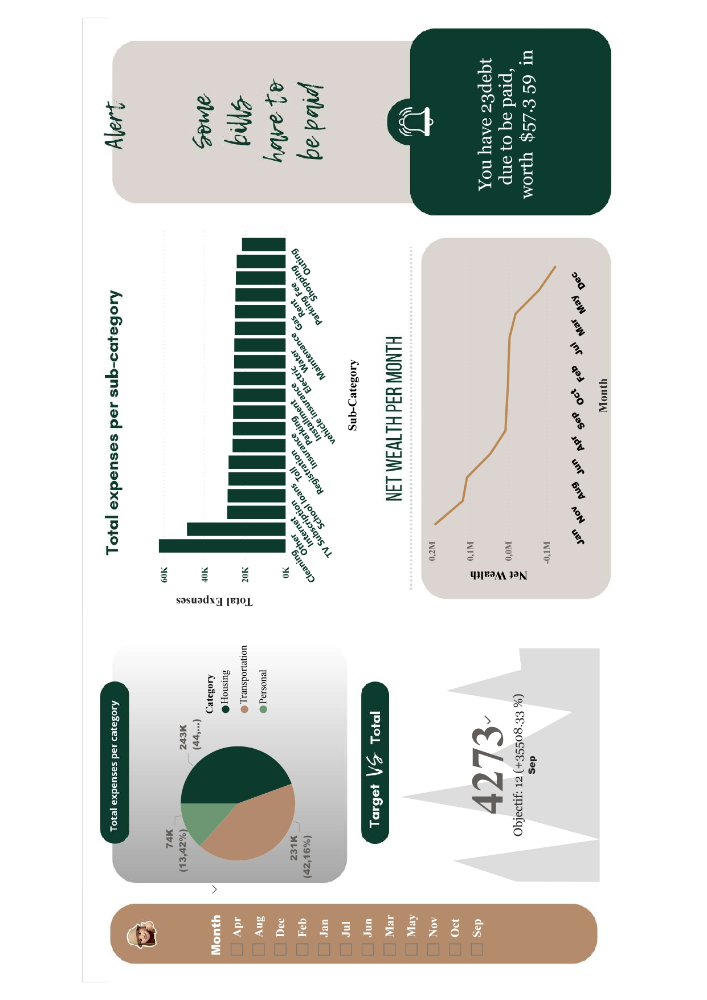

## Personal Financial Dashboard 


#### Overview
This **Personal Financial Dashboard** visualizes income, expenses, and savings trends using **Microsoft Power BI** and **DAX formulas**. Designed as a final project for a bachelor's-level Advanced Databases course, it transforms raw financial data into actionable insights for budgeting and financial planning.

---

#### Key Features
- **Income/Expense Tracking**: Monitor total income (`798K`), main/side income splits, and monthly trends.
- **Category Analysis**: Breakdown of spending (e.g., `Housing: 243K`, `Transportation: 231K`).
- **Debt Alerts**: Highlights pending debts (e.g., `$57.3K due`).
- **Dynamic Visuals**: Line charts, pie charts, and tables updated with DAX logic.
- **Net Wealth Trends**: Track monthly net wealth changes.

---

#### Technologies Used
- **BI Tool**: Microsoft Power BI Desktop
- **Data Modeling**: DAX (Data Analysis Expressions)
- **Dataset**: [Specify dataset name/source]
- **Data Cleaning**: Power Query Editor

---

#### Dashboard Preview

<div align="center">

#### Main Financial Overview
  
*Highlights: Available income (`798K`), income sources breakdown, and expense trends across months.*

**Key Metrics**:
- **Total Income**: `798K` (Main: `481K`, Side: `317K`)
- **Top Expenses**: Housing (`243K`), Transportation (`231K`)
- **Monthly Trends**: Income vs. expenses comparison (Dec to Sep)

---

#### Detailed Expense Analysis
  
*Drill-down into expense categories, sub-categories, and net wealth trends.*

**Key Insights**:
- **Category Spending**: Housing (`44%`), Transportation (`42%`)
- **Sub-Category Breakdown**: Visualized via bar charts
- **Net Wealth**: Monthly progression with debt alerts (`$57.3K due`)

</div>

---

#### Setup Guide
1. **Clone the Repository**:
   ```bash
   git clone https://github.com/aelmah/PowerBI-BudgetPulse.git


2. **Open in Power BI:**

Open the .pbix file in Power BI Desktop.

Update the dataset path in Power Query to match your local data/Dataset.csv.


3. **Explore:**

Use filters to adjust date ranges or categories.

Hover over charts for tooltip details.

